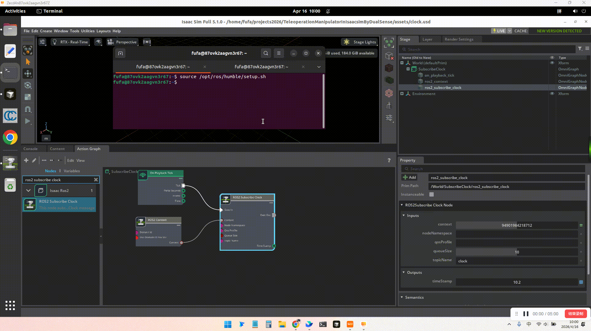

# TeleoperationManipulatorInIsaacsimByDualSense
使用DualSense手柄遥操isaacsim的机械臂

## 一、硬件连接
我的连接链路: 手柄 --> Windows11电脑 --> 无影客户端 --> IsaacSim(无影云电脑中)

### 1. 手柄连接Windows11电脑
手柄型号是PS5的DualSense, 手柄连接电脑有两种方式，一种是USB，一种是蓝牙

#### 蓝牙连接
[连接教程](https://www.playstation.com/zh-hans-cn/support/hardware/pair-dualsense-controller-bluetooth/)


为了验证windows11是否成功识别到DualSense手柄, 需要找个可视化界面观察下各个按键是否正常，
我找到的是[RemotePlayInstaller.exe](https://remoteplay.dl.playstation.net/remoteplay/lang/cs/index.html), 但是公司电脑不让装， 所以改用[DS4Windows](https://ds4-windows.com/about/), 安装后测试结果如下图


但是无影似乎不支持蓝牙连接的映射, 所以后面使用USB连接

#### USB连接
直接用USB线连接即可，连接后可以在设备管理器中看到设备信息


### 2. DualSense手柄连接到无影机器
上面已经通过USB将DualSense手柄连接到Windows电脑上， 现在要把这个手柄重定向到无影云电脑中，[官方教程](https://help.aliyun.com/zh/wtc/user-guide/use-game-controllers)


#### 连接
我的无影电脑内核
```
uname -a
Linux 87ovk2aagvn3r67 5.15.0-125-generic #135-Ubuntu SMP Fri Sep 27 13:53:58 UTC 2024 x86_64 x86_64 x86_64 GNU/Linux
```

首先， 需要为这台无影云电脑配置策略， 可以找管理员或无影的工作人员。

然后，就可以在外设中看到DualSense手柄了，


#### 验证
##### lsusb
```

lsusb | grep Sony
# 或者查看输入设备列表
cat /proc/bus/input/devices | grep -i "Sony"
```
##### jstest-gtk
```
sudo apt install jstest-gtk

jstest-gtk
```

##### jstest
```
sudo apt install joystick

jstest /dev/input/js1
```

##### evtest
```
sudo apt install evtest

evtest
```


 
## 二、环境安装

### 1. 安装isaacsim和对应资产
在无影中安装isaacsim5.1

安装目录建议安装在$HOME目录, isaacsim和资产可以选择一个版本安装，不必全部安装

官方推荐安装到$HOME/isaacsim文件夹下，但是我这个文件已经创建了，我就安装到$HOME/isaac_sim中了

```
mkdir -p $HOME/isaac_sim
cd $HOME/isaac_sim


# 下载软件和资产
wget https://download.isaacsim.omniverse.nvidia.com/isaac-sim-standalone-4.5.0-linux-x86_64.zip
wget https://download.isaacsim.omniverse.nvidia.com/isaac-sim-assets-1-4.5.0.zip
wget https://download.isaacsim.omniverse.nvidia.com/isaac-sim-assets-2-4.5.0.zip
wget https://download.isaacsim.omniverse.nvidia.com/isaac-sim-assets-3-4.5.0.zip
wget https://download.isaacsim.omniverse.nvidia.com/isaac-sim-standalone-5.1.0-linux-x86_64.zip
wget https://download.isaacsim.omniverse.nvidia.com/isaac-sim-assets-complete-5.1.0.zip.001
wget https://download.isaacsim.omniverse.nvidia.com/isaac-sim-assets-complete-5.1.0.zip.002
wget https://download.isaacsim.omniverse.nvidia.com/isaac-sim-assets-complete-5.1.0.zip.003


# 合并资产
cat isaac-sim-assets-1-4.5.0.zip  isaac-sim-assets-2-4.5.0.zip isaac-sim-assets-3-4.5.0.zip > isaac-sim-assets-4.5.0.zip
cat isaac-sim-assets-complete-5.1.0.zip.001 isaac-sim-assets-complete-5.1.0.zip.002 isaac-sim-assets-complete-5.1.0.zip.003 > isaac-sim-assets-5.1.0.zip


# 解压
unzip -d 4.5/ isaac-sim-standalone-4.5.0-linux-x86_64.zip
unzip -d 5.1/ isaac-sim-standalone-5.1.0-linux-x86_64.zip
unzip -d 4.5_asset isaac-sim-assets-4.5.0.zip
unzip -d 5.1_asset isaac-sim-assets-5.1.0.zip


# git管理, 有时候会误修改isaacsim软件中代码，所以用git管理下，如果有变化，可以及时发现
cd $HOME/isaac_sim/4.5/
git init
git add .
git commit -m "init"

cd $HOME/isaac_sim/4.5_asset/
git init
git add .
git commit -m "init"

cd $HOME/isaac_sim/5.1/
git init
git add .
git commit -m "init"

cd $HOME/isaac_sim/5.1_asset/
git init
git add .
git commit -m "init"

```

### 2. 配置isaacsim默认资产
isaacsim资产可以从网络和本地加载，上一步已经下载了资产，现在配置下，让isaacsim可以识别到

#### isaacsim5.1 配置
参考：https://docs.isaacsim.omniverse.nvidia.com/5.1.0/installation/install_faq.html

编辑apps/isaacsim.exp.base.kit文件，根据自身情况修改

```
[settings]
persistent.isaac.asset_root.default = "/home/fufa/isaac_sim/5.1_asset/Assets/Isaac/5.1"

exts."isaacsim.gui.content_browser".folders = [
    "/home/fufa/isaac_sim/5.1_asset/Assets/Isaac/5.1/Isaac/Robots",
    "/home/fufa/isaac_sim/5.1_asset/Assets/Isaac/5.1/Isaac/People",
    "/home/fufa/isaac_sim/5.1_asset/Assets/Isaac/5.1/Isaac/IsaacLab",
    "/home/fufa/isaac_sim/5.1_asset/Assets/Isaac/5.1/Isaac/Props",
    "/home/fufa/isaac_sim/5.1_asset/Assets/Isaac/5.1/Isaac/Environments",
    "/home/fufa/isaac_sim/5.1_asset/Assets/Isaac/5.1/Isaac/Materials",
    "/home/fufa/isaac_sim/5.1_asset/Assets/Isaac/5.1/Isaac/Samples",
    "/home/fufa/isaac_sim/5.1_asset/Assets/Isaac/5.1/Isaac/Sensors",
]

exts."isaacsim.asset.browser".folders = [
    "/home/fufa/isaac_sim/5.1_asset/Assets/Isaac/5.1/Isaac/Robots",
    "/home/fufa/isaac_sim/5.1_asset/Assets/Isaac/5.1/Isaac/People",
    "/home/fufa/isaac_sim/5.1_asset/Assets/Isaac/5.1/Isaac/IsaacLab",
    "/home/fufa/isaac_sim/5.1_asset/Assets/Isaac/5.1/Isaac/Props",
    "/home/fufa/isaac_sim/5.1_asset/Assets/Isaac/5.1/Isaac/Environments",
    "/home/fufa/isaac_sim/5.1_asset/Assets/Isaac/5.1/Isaac/Materials",
    "/home/fufa/isaac_sim/5.1_asset/Assets/Isaac/5.1/Isaac/Samples",
    "/home/fufa/isaac_sim/5.1_asset/Assets/Isaac/5.1/Isaac/Sensors",
]

```

### 3. 安装本项目
整个项目需要两个环境，一个是isaacsim的环境, 一个是conda环境
```
cd $HOME
git clone git@github.com:FelixFu520/TeleoperationManipulatorInIsaacsimByDualSense.git
cd $HOME/TeleoperationManipulatorInIsaacsimByDualSense

# (0) 安装ROS
参考[官方文档](https://docs.isaacsim.omniverse.nvidia.com/5.1.0/installation/install_ros.html)，也可也参考ROS官方的文档， ROS2用于在主机上传信号给isaacsim中的机械臂

# (1) 链接isaacsim环境
# 链接isaacsim, 我这里链接的是isaacsim5.1，可以根据需要选择不同的版本
ln -s $HOME/isaac_sim/5.1 app   # 链接isaacsim5.1, 使用isaacsim环境

# (2) 安装conda环境
# python版本要和系统中ROS2一致，主要是为了调用里面的rclpy，我的系统是ubuntu22.04，Humble
conda create -n tele python=3.10  
# 安装获取手柄信号的库
pip install evdev -i https://pypi.tuna.tsinghua.edu.cn/simple
# 安装解ik相关的库
pip install pin pin-pink daqp -i https://pypi.tuna.tsinghua.edu.cn/simple

```

## 三、模块测试
上面已经把硬件连接到无影中了，而且环境也安装了，接下来就使用代码读取DualSense手柄信号，搭建仿真场景，链接两者
### 1. 使用代码获取DualSence数据
```
设备属于 input 组，但你的用户不在 input 组中。两种方式解决：

方式 1（推荐，永久生效）：把用户加入 input 组

sudo usermod -aG input fufa
加完后需要重新登录才生效。如果不想重新登录，可以用方式 2 临时解决。

方式 2（临时，立即生效）：直接改设备权限

sudo chmod a+r /dev/input/event6  #
执行方式 2 后，就可以不用 sudo 直接运行了：


source /opt/ros/humble/setup.bash
conda activate tele
python tools/dualsense.py --device /dev/input/event6
```


### 2. 在Isaacsim中操作机械臂(无Omniraph, 直接控制关节)
```
cd asset
ln -s /home/fufa/isaac_sim/5.1_asset/Assets/Isaac/5.1/Isaac Isaac

启动Isaacsim
./app/isaac-sim.sh \
--/persistent/isaac/asset_root/default=/home/fufa/isaac_sim/5.1_asset/Assets/Isaac/5.1

```
参考[官方入门教程](https://docs.isaacsim.omniverse.nvidia.com/5.1.0/introduction/quickstart_isaacsim_robot.html)配置Franka机械臂，
配置好的usd在`assets/franka.usd`


### 3. 通过ROS控制Isaacsim中的Graph(Omniraph, 通过接收ROS信号控制)
Isaacsim如何和ROS配合呢？

Isaacsim中独立装了一套ROS， 需要在主机上再装个ROS， 需要保证两个ros系统`ROS_DOMAIN_ID`一致，通过主机上的ROS来控制仿真中的ROS，
仿真中通过ActionGraph直接调用ROS官方的API

首先，在主机上安装ROS2，参考[官方文档](https://docs.isaacsim.omniverse.nvidia.com/5.1.0/installation/install_ros.html)

然后，通过ROS2[入门示例](https://docs.isaacsim.omniverse.nvidia.com/5.1.0/ros2_tutorials/tutorial_ros2_clock.html)对其有初步的了解

在这里只需要定义一个Subscriber就行， `assets/clock.usd`文件是我做好的资产， 然后按照下面的方式运行即可以验证通过主机上ROS控制Isaacsim
中的Omniraph

```
source /opt/ros/humble/setup.sh

ros2 topic pub  -t 1 /clock rosgraph_msgs/Clock "clock: { sec: 1, nanosec: 200000000 }"

ros2 topic pub  -t 1 /clock rosgraph_msgs/Clock "clock: { sec: 40, nanosec: 200000000 }"
```



上面clock例子只是入门， 现在要用主机上的ros2来控制上一步做好的franka机械臂`assets/franka.usd`, 需要修改`franka.usd`文件并保存为`franka01.usd`, 下面是控制过程的演示


```
source /opt/ros/humble/setup.sh

# 复位
ros2 topic pub /joint_command sensor_msgs/msg/JointState "{
  header: {stamp: {sec: 0, nanosec: 0}, frame_id: ''},
  name: ['panda_finger_joint1', 'panda_joint1', 'panda_joint2', 'panda_joint3', 'panda_joint4', 'panda_joint5', 'panda_joint6', 'panda_joint7'],
  position: [0.0, 0.0, -0.5, 0.0, -1.5, 0.0, 1.0, 0.785],
  velocity: [],
  effort: []
}"

# panda_finger_joint1
ros2 topic pub /joint_command sensor_msgs/msg/JointState "{
  header: {stamp: {sec: 0, nanosec: 0}, frame_id: ''},
  name: ['panda_finger_joint1', 'panda_joint1', 'panda_joint2', 'panda_joint3', 'panda_joint4', 'panda_joint5', 'panda_joint6', 'panda_joint7'],
  position: [0.4, 0.0, -0.5, 0.0, -1.5, 0.0, 1.0, 0.785],
  velocity: [],
  effort: []
}"

# panda_joint1
ros2 topic pub /joint_command sensor_msgs/msg/JointState "{
  header: {stamp: {sec: 0, nanosec: 0}, frame_id: ''},
  name: ['panda_finger_joint1', 'panda_joint1', 'panda_joint2', 'panda_joint3', 'panda_joint4', 'panda_joint5', 'panda_joint6', 'panda_joint7'],
  position: [0.4, 0.5, -0.5, 0.0, -1.5, 0.0, 1.0, 0.785],
  velocity: [],
  effort: []
}"

# panda_joint2
ros2 topic pub /joint_command sensor_msgs/msg/JointState "{
  header: {stamp: {sec: 0, nanosec: 0}, frame_id: ''},
  name: ['panda_finger_joint1', 'panda_joint1', 'panda_joint2', 'panda_joint3', 'panda_joint4', 'panda_joint5', 'panda_joint6', 'panda_joint7'],
  position: [0.4, 0.5, 0.0, 0.0, -1.5, 0.0, 1.0, 0.785],
  velocity: [],
  effort: []
}"

# panda_joint3
ros2 topic pub /joint_command sensor_msgs/msg/JointState "{
  header: {stamp: {sec: 0, nanosec: 0}, frame_id: ''},
  name: ['panda_finger_joint1', 'panda_joint1', 'panda_joint2', 'panda_joint3', 'panda_joint4', 'panda_joint5', 'panda_joint6', 'panda_joint7'],
  position: [0.4, 0.5, 0.0, 0.5, -1.5, 0.0, 1.0, 0.785],
  velocity: [],
  effort: []
}"

# panda_joint4
ros2 topic pub /joint_command sensor_msgs/msg/JointState "{
  header: {stamp: {sec: 0, nanosec: 0}, frame_id: ''},
  name: ['panda_finger_joint1', 'panda_joint1', 'panda_joint2', 'panda_joint3', 'panda_joint4', 'panda_joint5', 'panda_joint6', 'panda_joint7'],
  position: [0.4, 0.5, 0.0, 0.5, -0.5, 0.0, 1.0, 0.785],
  velocity: [],
  effort: []
}"

# panda_joint5
ros2 topic pub /joint_command sensor_msgs/msg/JointState "{
  header: {stamp: {sec: 0, nanosec: 0}, frame_id: ''},
  name: ['panda_finger_joint1', 'panda_joint1', 'panda_joint2', 'panda_joint3', 'panda_joint4', 'panda_joint5', 'panda_joint6', 'panda_joint7'],
  position: [0.4, 0.5, 0.0, 0.5, -0.5, 0.5, 1.0, 0.785],
  velocity: [],
  effort: []
}"

# panda_joint6
ros2 topic pub /joint_command sensor_msgs/msg/JointState "{
  header: {stamp: {sec: 0, nanosec: 0}, frame_id: ''},
  name: ['panda_finger_joint1', 'panda_joint1', 'panda_joint2', 'panda_joint3', 'panda_joint4', 'panda_joint5', 'panda_joint6', 'panda_joint7'],
  position: [0.4, 0.5, 0.0, 0.5, -0.5, 0.5, 0.5, 0.785],
  velocity: [],
  effort: []
}"

# panda_joint7
ros2 topic pub /joint_command sensor_msgs/msg/JointState "{
  header: {stamp: {sec: 0, nanosec: 0}, frame_id: ''},
  name: ['panda_finger_joint1', 'panda_joint1', 'panda_joint2', 'panda_joint3', 'panda_joint4', 'panda_joint5', 'panda_joint6', 'panda_joint7'],
  position: [0.4, 0.5, 0.0, 0.5, -0.5, 0.5, 0.5, 0.0],
  velocity: [],
  effort: []
}"

```


### 4. 逆运动学（Inverse Kinematics, IK）
我们想通过控制机械臂的末端来控制机械臂所有关节， 这时候需要IK来反求出所有机械臂的关节数值

我让AI实现了两个版本
```
# 调用isaacsim库
./app/python.sh tools/franka_ik.py --x 0.4 --y 0.0 --z 0.5 --roll 0 --pitch 3.14 --yaw 0

# 不掉用isaacsim库
conda activate tele
python tools/franka_ik_noisaacsim.py --x 0.4 --y 0.0 --z 0.5 --roll 0 --pitch 3.14 --yaw 0
```

## 四、DualSense在Isaacsim中采集数据
将模块测试的内容连接起来，实现DualSense在Isaacsim中采集数据

### 1. 定义控制信号
通过Franka的末端控制整个机械臂, 末端位置有(x,y,z)，(roll, pitch, yaw) 6个数字，然后通过
- `左摇杆`控制x,y。 左右控制y, 默认值127，最左0， 最右255； 上下控制x, 默认值127， 最下255，最上0
- `△ 三角键`控制z持续向上。 0是没操作，1是持续向上
- `X (交叉键)`控制z持续向下。0是没操作，1是持续向下

- `右摇杆`控制roll,pitch。 左右控制roll, 默认值127，最左0， 最右255； 上下控制pitch，默认值127， 最下255，最上0
- `方向键(上)`控制yaw持续向上看。 0是没操作，-1是持续向上
- `方向键(下)`控制yaw持续向下看。 0是没操作，1是持续向下

- `R2`控制夹爪。 默认值0， 对应夹爪开，按到底255，对应夹爪关

### 2. play isaacsim场景
```
./app/isaac-sim.sh \
--/persistent/isaac/asset_root/default=/home/fufa/isaac_sim/5.1_asset/Assets/Isaac/5.1

把`assets/franka02.usd`拖进isaacsim中
``` 


### 3. 发送控制信号
```
source /opt/ros/humble/setup.bash
# 注意， 一定要给用户input读取权限
sudo chmod a+r /dev/input/event6  # /dev名称可能有变化
# 向isaacsim中发送控制信号
conda activate tele
python teleoperation_manipulator.py --device /dev/input/event6
```
