# TeleoperationManipulatorInIsaacsimByDualSense
使用DualSense手柄遥操isaacsim的机械臂

## 硬件连接
我的连接链路: 手柄 --> Windows11电脑 --> 无影客户端 --> IsaacSim(无影云电脑中)

### 手柄连接Windows11电脑
手柄型号是PS5的DualSence, 手柄连接电脑有两种方式，一种是USB，一种是蓝牙

#### 蓝牙连接
[连接教程](https://www.playstation.com/zh-hans-cn/support/hardware/pair-dualsense-controller-bluetooth/)

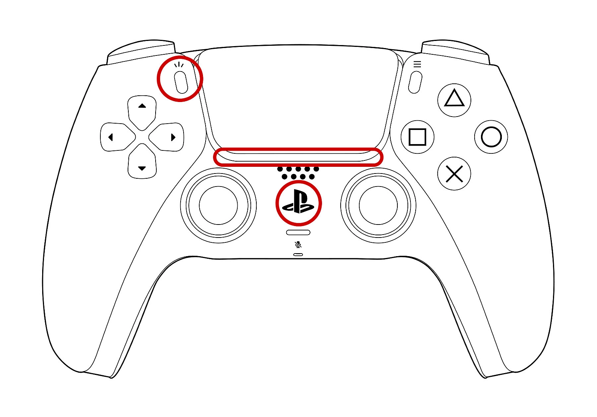

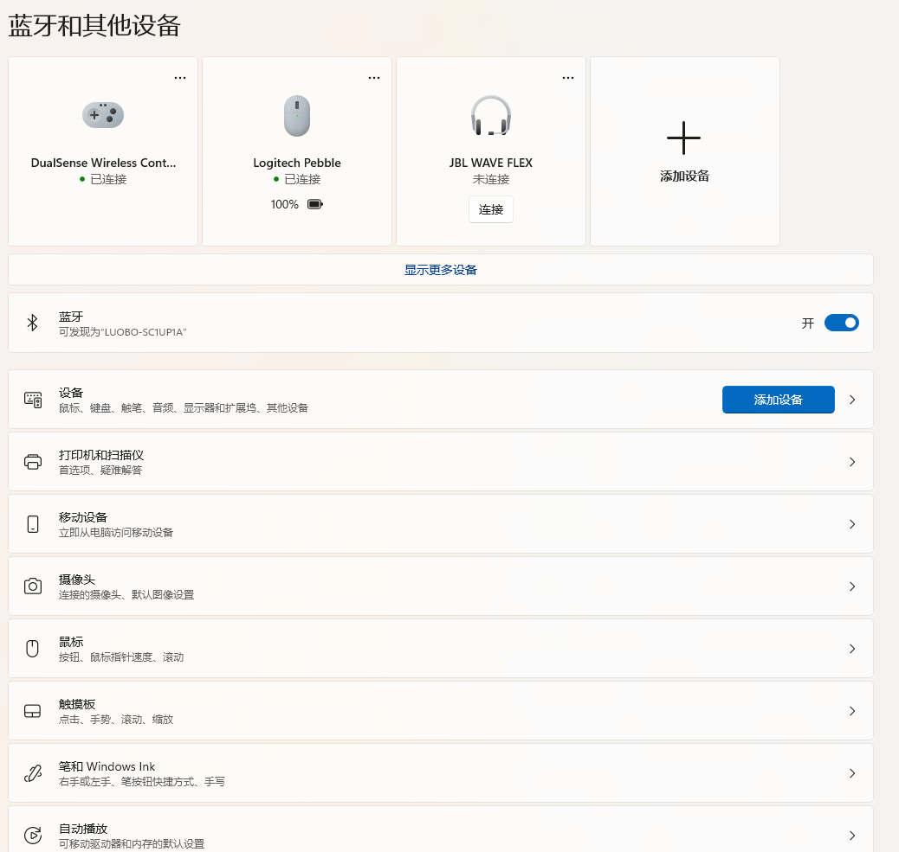

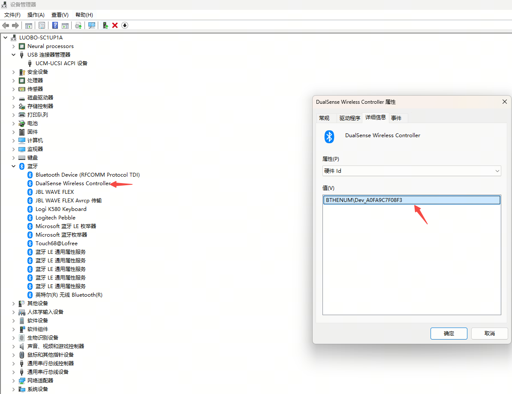


为了验证windows11是否成功识别到DualSence手柄, 需要找个可视化界面观察下各个按键是否正常，
我找到的是[RemotePlayInstaller.exe](https://remoteplay.dl.playstation.net/remoteplay/lang/cs/index.html), 但是公司电脑不让装， 所以改用[DS4Windows](https://ds4-windows.com/about/), 安装后测试结果如下图

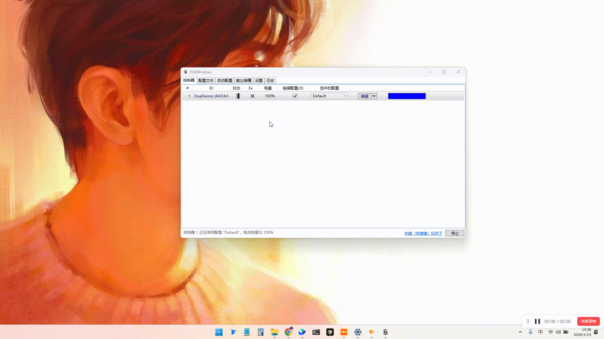


但是无影似乎不支持蓝牙连接的映射, 所以后面使用USB连接

#### USB连接
直接用USB线连接即可，连接后可以在设备管理器中看到设备信息

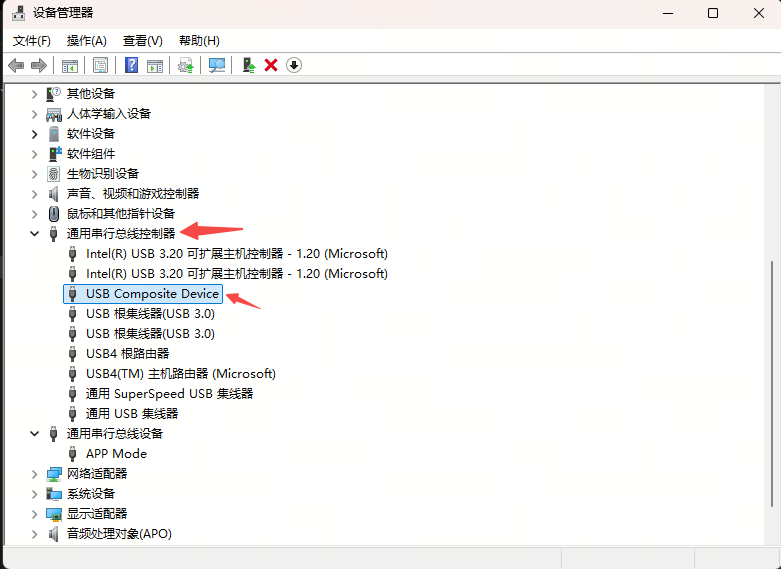

### DualSense手柄连接到无影机器
上面已经通过USB将DualSence手柄连接到Windows电脑上， 现在要把这个手柄重定向到无影云电脑中，[官方教程](https://help.aliyun.com/zh/wtc/user-guide/use-game-controllers)

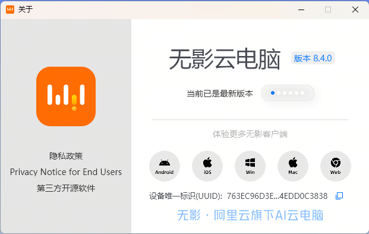

#### 连接
我的无影电脑内核
```
uname -a
Linux 87ovk2aagvn3r67 5.15.0-125-generic #135-Ubuntu SMP Fri Sep 27 13:53:58 UTC 2024 x86_64 x86_64 x86_64 GNU/Linux
```

首先， 需要为这台无影云电脑配置策略， 可以找管理员或无影的工作人员。

然后，就可以在外设中看到DualSence手柄了，

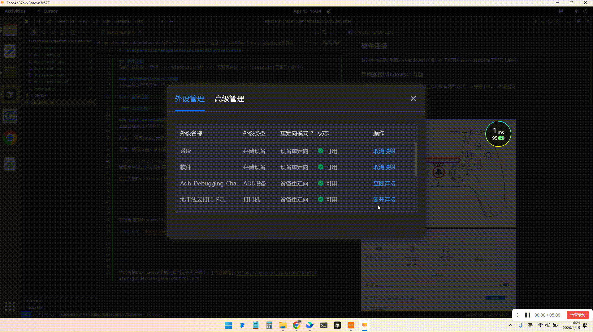

#### 验证
##### lsusb
```

lsusb | grep Sony
# 或者查看输入设备列表
cat /proc/bus/input/devices | grep -i "Sony"
```
##### jstest-gtk
```
sudo apt install jstest-gtk

jstest-gtk
```
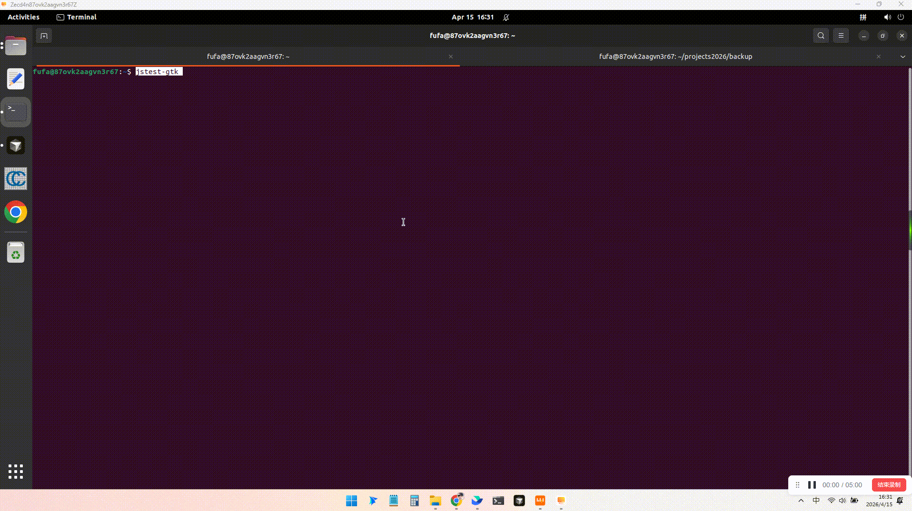
##### jstest
```
sudo apt install joystick

jstest /dev/input/js1
```
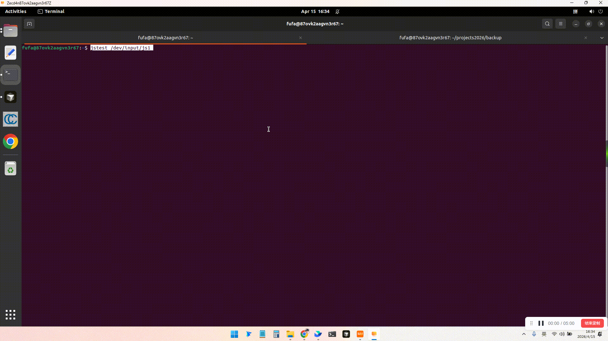

##### evtest
```
sudo apt install evtest

evtest
```
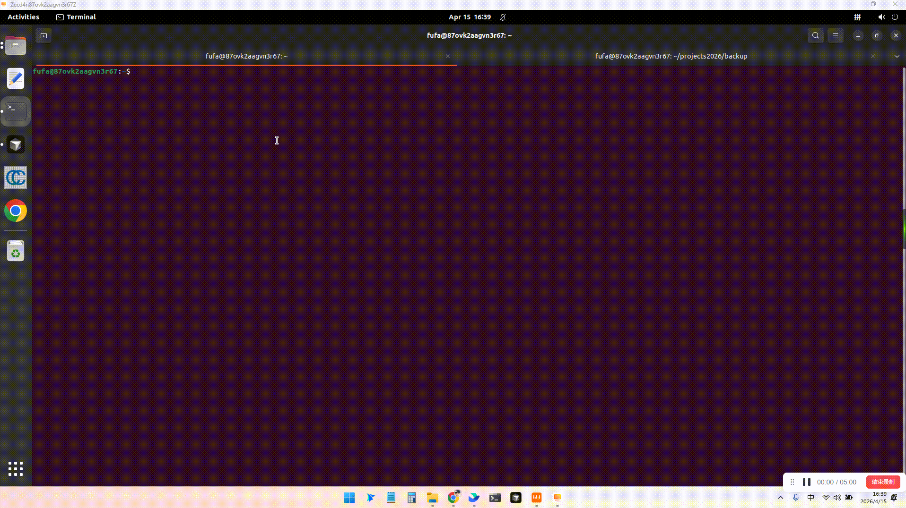

 
## 安装isaacsim
在无影中安装isaacsim
### 安装isaacsim和对应资产
安装目录建议安装在$HOME目录, isaacsim和资产可以选择一个版本安装，不必全部安装

官方推荐安装到$HOME/isaacsim文件夹下，但是我这个文件已经创建了，我就安装到$HOME/isaac_sim中了

```
mkdir -p $HOME/isaac_sim
cd $HOME/isaac_sim


# 下载软件和资产
wget https://download.isaacsim.omniverse.nvidia.com/isaac-sim-standalone-4.5.0-linux-x86_64.zip
wget https://download.isaacsim.omniverse.nvidia.com/isaac-sim-assets-1-4.5.0.zip
wget https://download.isaacsim.omniverse.nvidia.com/isaac-sim-assets-2-4.5.0.zip
wget https://download.isaacsim.omniverse.nvidia.com/isaac-sim-assets-3-4.5.0.zip
wget https://download.isaacsim.omniverse.nvidia.com/isaac-sim-standalone-5.1.0-linux-x86_64.zip
wget https://download.isaacsim.omniverse.nvidia.com/isaac-sim-assets-complete-5.1.0.zip.001
wget https://download.isaacsim.omniverse.nvidia.com/isaac-sim-assets-complete-5.1.0.zip.002
wget https://download.isaacsim.omniverse.nvidia.com/isaac-sim-assets-complete-5.1.0.zip.003


# 合并资产
cat isaac-sim-assets-1-4.5.0.zip  isaac-sim-assets-2-4.5.0.zip isaac-sim-assets-3-4.5.0.zip > isaac-sim-assets-4.5.0.zip
cat isaac-sim-assets-complete-5.1.0.zip.001 isaac-sim-assets-complete-5.1.0.zip.002 isaac-sim-assets-complete-5.1.0.zip.003 > isaac-sim-assets-5.1.0.zip


# 解压
unzip -d 4.5/ isaac-sim-standalone-4.5.0-linux-x86_64.zip
unzip -d 5.1/ isaac-sim-standalone-5.1.0-linux-x86_64.zip
unzip -d 4.5_asset isaac-sim-assets-4.5.0.zip
unzip -d 5.1_asset isaac-sim-assets-5.1.0.zip


# git管理, 有时候会误修改isaacsim软件中代码，所以用git管理下，如果有变化，可以及时发现
cd $HOME/isaac_sim/4.5/
git init
git add .
git commit -m "init"

cd $HOME/isaac_sim/4.5_asset/
git init
git add .
git commit -m "init"

cd $HOME/isaac_sim/5.1/
git init
git add .
git commit -m "init"

cd $HOME/isaac_sim/5.1_asset/
git init
git add .
git commit -m "init"

```
### 配置isaacsim默认资产
isaacsim资产可以从网络和本地加载，上一步已经下载了资产，现在配置下，让isaacsim可以识别到
#### 5.1 配置
参考：https://docs.isaacsim.omniverse.nvidia.com/5.1.0/installation/install_faq.html

编辑apps/isaacsim.exp.base.kit文件，根据自身情况修改

```
[settings]
persistent.isaac.asset_root.default = "/home/fufa/isaac_sim/5.1_asset/Assets/Isaac/5.1"

exts."isaacsim.gui.content_browser".folders = [
    "/home/fufa/isaac_sim/5.1_asset/Assets/Isaac/5.1/Isaac/Robots",
    "/home/fufa/isaac_sim/5.1_asset/Assets/Isaac/5.1/Isaac/People",
    "/home/fufa/isaac_sim/5.1_asset/Assets/Isaac/5.1/Isaac/IsaacLab",
    "/home/fufa/isaac_sim/5.1_asset/Assets/Isaac/5.1/Isaac/Props",
    "/home/fufa/isaac_sim/5.1_asset/Assets/Isaac/5.1/Isaac/Environments",
    "/home/fufa/isaac_sim/5.1_asset/Assets/Isaac/5.1/Isaac/Materials",
    "/home/fufa/isaac_sim/5.1_asset/Assets/Isaac/5.1/Isaac/Samples",
    "/home/fufa/isaac_sim/5.1_asset/Assets/Isaac/5.1/Isaac/Sensors",
]

exts."isaacsim.asset.browser".folders = [
    "/home/fufa/isaac_sim/5.1_asset/Assets/Isaac/5.1/Isaac/Robots",
    "/home/fufa/isaac_sim/5.1_asset/Assets/Isaac/5.1/Isaac/People",
    "/home/fufa/isaac_sim/5.1_asset/Assets/Isaac/5.1/Isaac/IsaacLab",
    "/home/fufa/isaac_sim/5.1_asset/Assets/Isaac/5.1/Isaac/Props",
    "/home/fufa/isaac_sim/5.1_asset/Assets/Isaac/5.1/Isaac/Environments",
    "/home/fufa/isaac_sim/5.1_asset/Assets/Isaac/5.1/Isaac/Materials",
    "/home/fufa/isaac_sim/5.1_asset/Assets/Isaac/5.1/Isaac/Samples",
    "/home/fufa/isaac_sim/5.1_asset/Assets/Isaac/5.1/Isaac/Sensors",
]

```

## 安装本项目
```
cd $HOME
git clone git@github.com:FelixFu520/TeleoperationManipulatorInIsaacsimByDualSense.git
cd $HOME/TeleoperationManipulatorInIsaacsimByDualSense

# 链接isaacsim, 我这里链接的是isaacsim5.1，可以根据需要选择不同的版本
ln -s $HOME/isaac_sim/5.1 app   # 链接isaacsim5.1, 使用isaacsim环境
```

## 使用代码获取DualSence数据
先安装evdev
```
./app/python.sh -m pip install evdev

sudo ./app/python.sh tools/show_dualsense.py --device /dev/input/event6
```
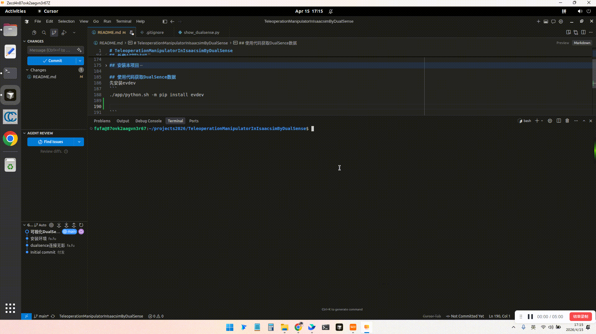

## 在Isaacsim中操作机械臂
```
cd asset
ln -s /home/fufa/isaac_sim/5.1_asset/Assets/Isaac/5.1/Isaac Isaac

启动Isaacsim
./app/isaac-sim.sh \
--/persistent/isaac/asset_root/default=/home/fufa/isaac_sim/5.1_asset/Assets/Isaac/5.1

```
参考[官方入门教程](https://docs.isaacsim.omniverse.nvidia.com/5.1.0/introduction/quickstart_isaacsim_robot.html)配置Franka机械臂，
配置好的usd在`assets/franka.usd`

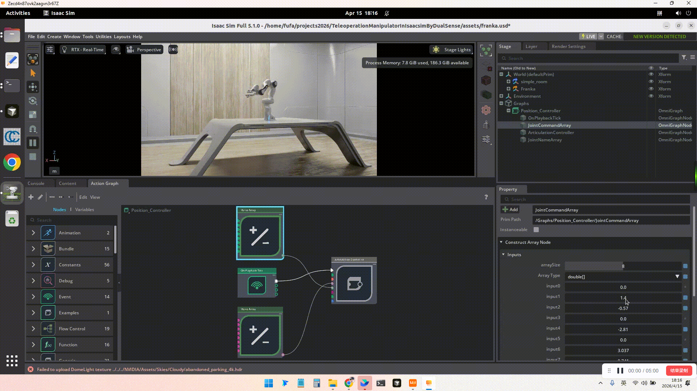

## 通过ROS控制Isaacsim中的Graph

## DualSense在Isaacsim中采集数据
通过Franka的末端控制整个机械臂, 末端位置有(x,y,z)，(roll, pitch, yaw) 6个数字，然后通过
- `左摇杆`控制x,y。 左右默认值127，最左0， 最右255； 上下默认值127， 最下255，最上0
- `L3+左摇杆`控制z。左右默认值127，最左0， 最右255(左右不使用)； 上下默认值127， 最下255，最上0
- `右摇杆`控制roll,pitch。 左右默认值127，最左0， 最右255； 上下默认值127， 最下255，最上0
- `L3+右摇杆`控制yaw。左右默认值127，最左0， 最右255(左右不使用)； 上下默认值127， 最下255，最上0
- `R2`控制夹爪。 默认值0，按到底255